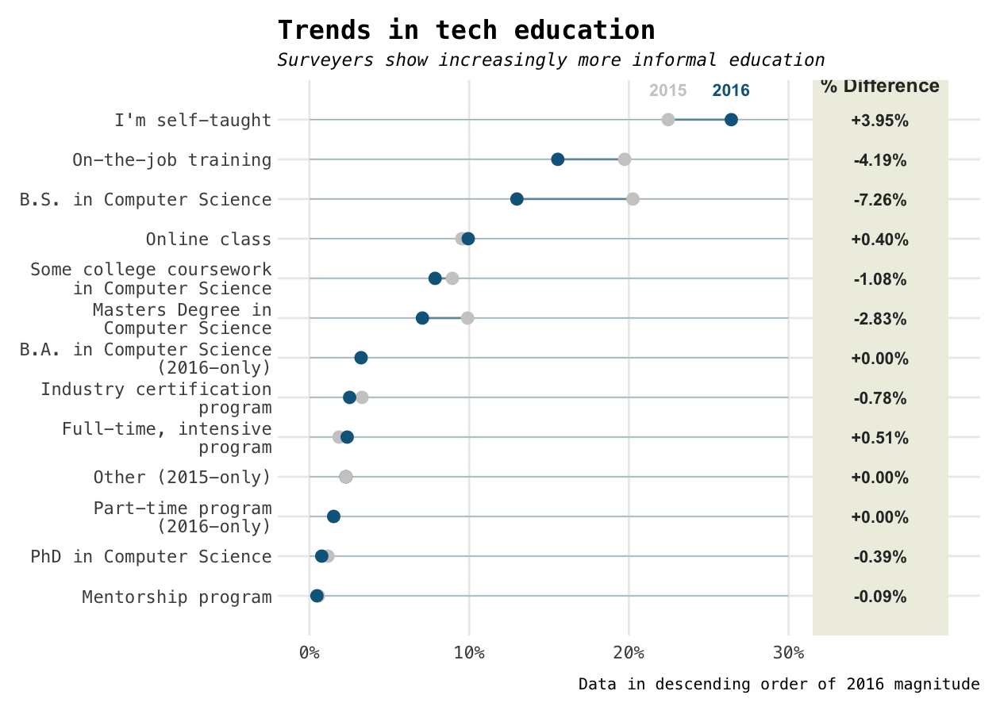
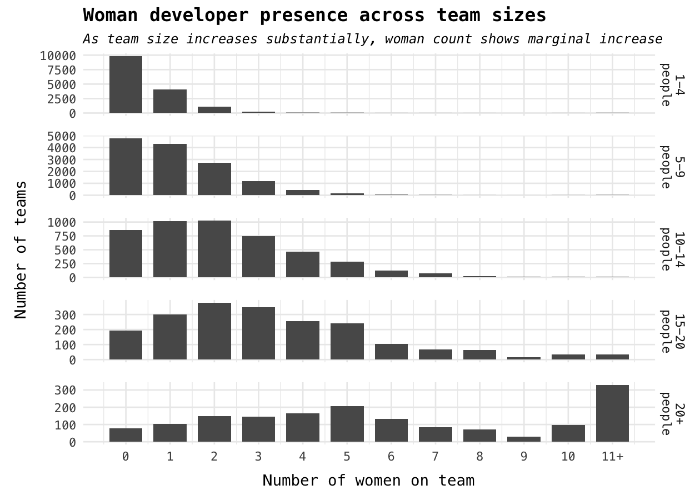
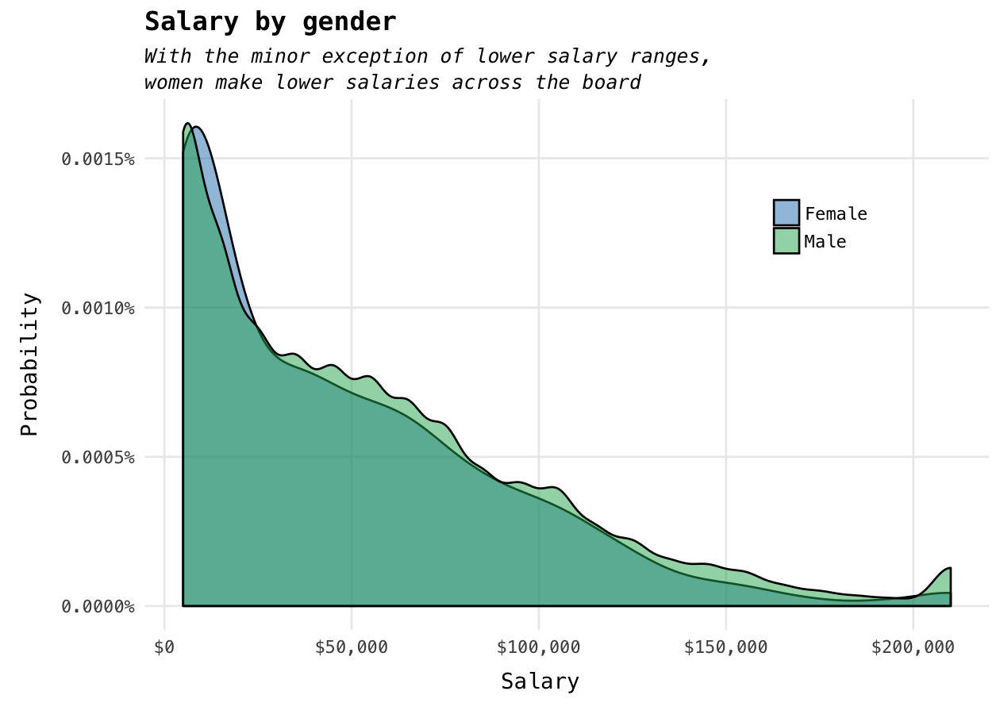
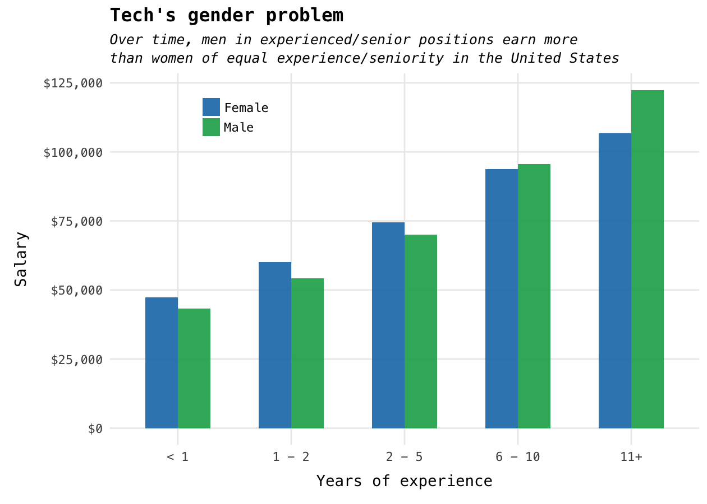

[StackOverflow](http://stackoverflow.com/) doesn't really need an introduction -- it's where you go when you [mess something up on Git](http://stackoverflow.com/questions/927358/how-to-undo-last-commits-in-git), [try to parse HTML with regex](http://stackoverflow.com/questions/1732348/regex-match-open-tags-except-xhtml-self-contained-tags/1732454#1732454), or [need a laugh](http://stackoverflow.com/questions/184618/what-is-the-best-comment-in-source-code-you-have-ever-encountered). They have a very helpful community of developers, and recently released their [2016 Developer Survey Results](http://stackoverflow.com/research/developer-survey-2016) including a breakdown on many of the variables included in their annual Developer Survey.

In many ways, the Developer Survey can give us insight about the general state of software engineering and, broadly speaking, the tech field.

Sourcing our data
=================

All of the data can be downloaded [directly from StackOverflow](http://stackoverflow.com/research/) under the Open Database License, which means we just have to attribute that it's StackOverflow's, we keep it open, and we keep any adapted databases open. Sounds easy enough!

This dataset is a survey of data collected *internationally*, meaning we can't expect perfectly clean or complete data (can we ever?). Furthermore, given it's a survey, we can expect to be dealing with multiple confounding factors like *self-selection bias*, *incentive bias*, and *completion bias*, among others.

> There's a great daily mailing list -- [Data Driven Daily](datadrivendaily.io) -- that really helped me understand the issues with designing, interpreting, and -- most of all -- analyzing survey data. I highly recommend you check it out!

Let's explore what we can learn about developers and the state of the tech industry!

``` r
# Some behind-the-curtains setup
library(knitr)
library(stringr)
library(scales)
library(reshape2)
library(ggthemes)
library(ggalt)
library(tidyverse)

knitr::opts_chunk$set(
  cache = TRUE, 
  warning = FALSE, 
  message = FALSE, 
  dpi = 180,
  comment = "#>",
  collapse = TRUE
)

options(width = 75)

theme_set(theme_minimal(base_family = "Menlo") +
            theme(plot.title=element_text(family = "Menlo")))
```

Data wrangling / cleaning
=========================

Ah, survey data. When I finally got around to using this dataset, I started to realize how bad we are at recording multiple-response answers into one field. You'll see what I mean in a bit.

``` r
# Read in that data and drop columns we don't need/want.
data <- 
  read_csv("../data/2016 Stack Overflow Survey Responses.csv") %>%
  select(-one_of(c("X1", "collector", "age_midpoint", 
                   "big_mac_index", "experience_midpoint")))
```

There are tons of interesting fields in this dataset, but an initial problem is that many hold responses to multiple-response answers. Fields like *self-identification*, *tech\_do*, *tech\_want*, *dev\_environment*, and more look like this:

``` r
# Get example of education's multiple-response responses.
data %>%
  select(education) %>%
  na.omit %>%
  sample_n(3)
```

    #> # A tibble: 3 × 1
    #>                                                                     education
    #>                                                                         <chr>
    #> 1                                                             I'm self-taught
    #> 2                I'm self-taught; B.A. in Computer Science (or related field)
    #> 3 I'm self-taught; On-the-job training; Some college coursework in Computer S

What does this mean? Well, it means we can't easily use this as a factor: not only can we not guarantee one answer-per-row, but we'll also have a **large** number of factors due to the combinatorial possibilities.

After some `dplyr` difficulty, I made some progress with parsing that helps us understand the distribution! We can now parse these columns to get tabular results of named responses to frequency as well as the number of options chosen per survey-taker:

``` r
# Get breakdown of responses by name.
breakdown.by.name <- . %>%
  as.list %>% 
  unlist(use.names = F) %>% 
  table(useNA = "ifany") %>%
  data.frame %>%
  rename(entries = ., frequency = Freq, .data = .) %>%
  arrange(desc(frequency))

# We have to use a custom length function because otherwise,
# rows with NA will be removed during the rapply(). This just
# lets us say length(NA) = 0.
length.with.na <- function(x) {
  ifelse(all(is.na(x)), yes = 0, no = length(x))
}

# Get breakdown of responses by response length.
breakdown.by.length <- . %>%
  as.list %>%
  rapply(., length.with.na) %>%
  unlist(use.names = F) %>% 
  table(useNA = "ifany") %>%
  data.frame %>%
  rename(entries = ., frequency = Freq, .data = .) %>%
  arrange(desc(frequency))
```

Otherwise, the dataset is fairly clean and we can proceed with our analysis. Woohoo!

Deep dive: education
====================

It's no surprise that there's been a recent flood into the tech world from generally quantitative fields (math, physics, material science, etc.), and also from non-traditional fields like finance and education. New programs, bootcamps, and resources for those looking to transition into tech are abundant, and I'd first want to know: what paths are current developers taking into tech, and does it say anything about the industry at large?

``` r
# Process data into `resource, frequency, % total`. It can be done!
education.by.name <- data %>%
  select(education) %>% 
  transmute(split = str_split(education, pattern = "; ")) %>%
  breakdown.by.name %>%
  mutate(percent.of.total = (frequency / sum(frequency)))

# Output our results.
education.by.name %>%
  mutate(percent.of.total = percent(percent.of.total)) %>%
  kable(col.names = c("Education level", "Frequency", "Total"),
        align = "lrr")
```

| Education level                                                |  Frequency|  Total|
|:---------------------------------------------------------------|----------:|------:|
| I'm self-taught                                                |      31508|  26.4%|
| On-the-job training                                            |      18548|  15.5%|
| B.S. in Computer Science (or related field)                    |      15494|  13.0%|
| Online class (e.g. Coursera, Codecademy, Khan Academy, etc.)   |      11861|   9.9%|
| NA                                                             |      11075|   9.3%|
| Some college coursework in Computer Science (or related field) |       9384|   7.9%|
| Masters Degree in Computer Science (or related field)          |       8441|   7.1%|
| B.A. in Computer Science (or related field)                    |       3858|   3.2%|
| Industry certification program                                 |       3002|   2.5%|
| Full-time, intensive program (e.g. "boot-camp")                |       2819|   2.4%|
| Part-time program (e.g. night school)                          |       1812|   1.5%|
| PhD in Computer Science (or related field)                     |        919|   0.8%|
| Mentorship program (e.g. Flatiron School, GDI, etc.)           |        560|   0.5%|

That's actually surprising! I've always thought the "traditional path" to becoming a developer was majoring in computer science, but even if we sum all college-related education levels, we still fall short of self-taught education level by a bit over 2%. Next I'd want to know about variety: how many educational resources are developers using?

``` r
# Same as above, but by answer length.
education.by.count <- data %>% 
  select(education) %>%
  transmute(split = c(str_split(education, pattern = "; "))) %>%
  breakdown.by.length %>%
  mutate(percent.of.total = percent((frequency / sum(frequency))))

# Into a table!
education.by.count %>%
  kable(col.names = c("Education channels", "Frequency", "Total"),
        align = "lrr")
```

| Education channels |  Frequency|  Total|
|:-------------------|----------:|------:|
| 1                  |      14541|  26.0%|
| 2                  |      11234|  20.0%|
| 0                  |      11075|  19.8%|
| 3                  |      10393|  18.5%|
| 4                  |       5512|   9.8%|
| 5                  |       2238|   4.0%|
| 6                  |        704|   1.3%|
| 7                  |        219|   0.4%|
| 8                  |         67|   0.1%|
| 9                  |         20|   0.0%|
| 12                 |         18|   0.0%|
| 10                 |          8|   0.0%|
| 11                 |          1|   0.0%|

After 3 resources, there seems to be a sharp drop-off in resource utilization. This might be useful for new bootcamps, educational programs, and transition programs to keep in mind when advertising or choosing their target demographic: **developers with 0 - 2 prior exposures to professional learning are likely your best bet**. As with most of the results we may discover in this analysis, however, we have to remember that there are multiple biases that may be influencing our data --- it may be the case that developers who are self-taught tend to interact with the StackOverflow ecosystem moreso than their formally-taught peers.

These results aren't too bad, but they're without context: how do these results compare relative to 2015's? With some work, I wrangled and got the 2015 Developer Survey results into appropriate shape:

``` r
# Read in our 2015 data set.
data.2015 <- 
  read_csv("../data/2015 Stack Overflow Developer Survey Responses.csv", skip = 1)

# We define a custom function so that our pipe counts no response as a 0. 
# This lets us effectively build a sparse matrix where we can then
# perform column-wise aggregations.
char.to.encode <- function(x) { ifelse(is.na(x), 0, 1) }

# Isolate and perform necessary transformations such that we arrive 
# at a similar data.frame as our initial: `resource, frequency, total`.
education.by.name.2015 <-
  data.2015 %>%
  select(starts_with("Training & Education")) %>%
  set_names(nm = str_replace(names(.), "Training & Education: ", "")) %>%
  mutate_all(.funs = function(x) {x %>% char.to.encode %>% sum}) %>%
  slice(1) %>%
  melt %>%
  rename(entries = variable, frequency = value) %>%
  mutate(percent.of.total = (frequency / sum(frequency))) %>%
  arrange(desc(frequency))

# Tabulate our dataframe
education.by.name.2015 %>%
  mutate(percent.of.total = percent(percent.of.total)) %>%
  kable(col.names = c("Education level", "Frequency", "Total"),
        align = "lrr")
```

| Education level                |  Frequency|  Total|
|:-------------------------------|----------:|------:|
| No formal training             |       8912|  22.5%|
| BS in CS                       |       8034|  20.3%|
| On the job                     |       7829|  19.7%|
| Masters in CS                  |       3928|   9.9%|
| Online Class                   |       3785|   9.5%|
| Some college, but no CS degree |       3550|   8.9%|
| Industry certification         |       1307|   3.3%|
| Other                          |        907|   2.3%|
| Boot camp or night school      |        735|   1.9%|
| PhD in CS                      |        459|   1.2%|
| Mentorship                     |        222|   0.6%|

Interesting! Having no formal training was also the most popular level of education in 2015, followed closely by having a BS in Computer Science and "On-the-job training". One dilemma of survey design is that we don't always have consistency across surveys: here, we notice that the 2015 survey has the option "Boot camp or night school", whereas the 2016 survey separates said option into "Full-time, intensive program (e.g. 'boot-camp')" and "Part-time program (e.g. night school)".

This disjunction makes pairing 2016 options with 2015 options a bit tricky --- in the end, I piled "Boot camp or night school" with 2016's "Full-time, intensive program" (the difference isn't very significant, but it was worth mentioning). Another issue with 2015's survey is that some survey-takers might consider a boot-camp or night school as "no formal training", leading to some potentially confused votes.

We can now join together the two data sets, do some cleaning, and make a plot of the change over time! Let's check it out:

``` r
# Prepare our dataframes for merging.
# Given we want to merge 2015 into 2016, we set 2016's ID field to 
# row names and manually align 2015 into the appropriate row.
education.by.name <- 
  education.by.name %>%
  na.omit() %>%
  mutate(year = as.factor(2016), ID = c(1:n()))

education.by.name.2015 <-
  education.by.name.2015 %>%
  mutate(year = as.factor(2015),
         ID = c(1, 3, 2, 6, 4, 5, 8, NA, 9, 11, 12))

# Two helper functions for down-the-line string tidying.
remove.related <- function(x) { str_replace(x, "\\(or related field\\)", "") }
remove.eg <- function(x) { str_replace(x, "(\\(e.g.*\\))", "") }

# Join our two data sets, tidy up our required columns.
education.joined <- 
  full_join(education.by.name.2015, education.by.name,
            by = "ID", suffix = c(".2015", ".2016")) %>%
  select(entries.2016, percent.of.total.2016, 
         entries.2015, percent.of.total.2015) %>%
  mutate_at(.cols = vars(entries.2016, entries.2015),
            .funs = as.character) %>%
  mutate(entries.2016 = entries.2016 %>% 
           remove.related %>% 
           remove.eg %>%
           str_trim(side = "right"))

# Define a helper function for noting which
# entries were only available in 2015 or 2016.
paste.year.only <- function(x, year) { paste(x, " (", year, "-only)", sep = "") }

# 1. Fill in missing 2016 entry with 2015 entry.
education.joined[8, c("entries.2016", "percent.of.total.2016")] <-
  c(paste.year.only(education.joined[8, "entries.2015"], "2015"), 
    education.joined[8, "percent.of.total.2015"])

# 2. Fill in missing 2015 entries with 2016 entries.
education.joined[c(12, 13), c("entries.2015", "percent.of.total.2015")] <-
  c(paste.year.only(education.joined[c(12, 13), "entries.2016"], "2016"),
    education.joined[c(12, 13), "percent.of.total.2016"])

# 3. Propogate (2)'s change to 2016 fields.
education.joined[c(12, 13), c("entries.2016", "percent.of.total.2016")] <-
  c(paste.year.only(education.joined[c(12, 13), "entries.2016"], "2016"), 
    education.joined[c(12, 13), "percent.of.total.2016"])

# Yeah, yeah, I know. Not great. *Sorry*.
education.joined$percent.of.total.2015 <- as.double(education.joined$percent.of.total.2015)
education.joined$percent.of.total.2016 <- as.double(education.joined$percent.of.total.2016)

# Set a $diff column with the percent change from 2015 to 2016.
education.joined$diff <- education.joined$percent.of.total.2016 - education.joined$percent.of.total.2015

# I went a *bit* overboard on this next plot, so I won't include the code here.
# If you're interested in seeing the code required to make it, feel free to
# check out this gist: https://gist.github.com/10f5603a8f25aa8ae4de5925c4494446
# or the Exploratorium repository with all of this code! 
# Just scroll (all the way) down.
```

``` r
db.plot
```



Note:

-   "B.A. in Computer Science" has no 2015 value because it was not an option for survey-takers in 2015.

-   In 2015, the closest option to 2016's "Part-time program (e.g. night school)" was "Boot camp or night school". I had to make the choice of whether to split "Boot camp or night school" between 2016's "Full-time, intensive program (e.g. 'boot-camp')" and "Part-time program (e.g. night school)", and chose bootcamp.

-   "Other (2015-only)" and "Part-time program (2015-only)" have no change from 2015 to 2016 because neither were present in the 2016 survey.

The results are pretty surprising! Basically the only education channel that saw a significant *increase* in reported usage was self-taught learning -- the rest generally show marginal increases or significant decreases. Of the resources that show significant decrease in reported usage, I'm not surprised to see "B.S. in Computer Science" -- it's likely that 2015 surveyers who had a B.A. in Computer Science defaulted to nearest equivalent: the B.S.

I, for one, welcome the increase in self-taught learning: it usually means the existing educational resources are lacking, and that needs to be known.

Gender diversity
================

It's no secret that one of tech's shortcomings is its lack of diversity --- gender, racial, and more. Although StackOverflow's surveys don't ask about race, we can get some insight into how the tech industry is incorporating women into tech roles.

``` r
# Women on team per team size range.
data %>%
  select(women_on_team) %>%
  filter(women_on_team != "I am not on a \"team\"") %>%
  table %>%
  data.frame %>%
  rename(women.on.team = ., frequency = Freq, .data = .) %>%
  arrange(desc(frequency)) %>%
  kable(col.names = c("Number of women on team", "Teams"))
```

| Number of women on team |  Teams|
|:------------------------|------:|
| 0                       |  15929|
| 1                       |   9835|
| 2                       |   5374|
| 3                       |   2643|
| 4                       |   1384|
| 5                       |    907|
| I'm not sure            |    528|
| 11+                     |    420|
| 6                       |    403|
| 7                       |    247|
| 8                       |    176|
| 10                      |    158|
| Other (please specify)  |    150|
| 9                       |     58|

A first-pass understanding of number of women on a particular team shows us just about what we've (unfortunately) grown to expect: a long-right tail of frequency. We can run the same analysis while incorporating team size, which gives us:

``` r
# Vectors of team sizes and women counts to exclude.
women.na <- c("I'm not sure", "Other (please specify)", "I am not on a \"team\"")
team.na <- c("I am not on a team", "I don't know", "Other (please specify)")

# Obtain breakdown of all team size ranges and number of women on that team.
women.on.teams <- data %>%
  select(women_on_team, team_size_range) %>%
  na.omit %>%
  filter(!(women_on_team %in% women.na),
         !(team_size_range %in% team.na)) %>%
  group_by(team_size_range, women_on_team) %>%
  summarize(n.responses = n()) %>%
  ungroup(women_on_team, team_size_range) %>%
  mutate_at(.cols = vars(women_on_team, team_size_range), 
            .funs = funs(as.factor))

# Define the order we'd like or team sizes to by ordered.
desired.team.size.order <- c("1-4 people", "5-9 people", "10-14 people",
                             "15-20 people", "20+ people")

# Do some processing to make our plots more easily interpretable, then plot.
women.on.teams %>%
  mutate(women_on_team = women_on_team %>% str_extract("\\d+") %>% as.numeric) %>%
  mutate(team_size_range = team_size_range %>% 
           factor(., levels = desired.team.size.order)) %>%
  ggplot(mapping = aes(x = women_on_team, y = n.responses)) +
    geom_bar(stat = "identity", width = 0.75) +
    facet_grid(team_size_range ~ ., scales = "free_y",
               labeller = labeller(team_size_range = label_wrap_gen(5))) +
    scale_x_continuous(breaks = 0:11, labels = c(0:10, "11+")) +
    labs(x = "Number of women on team", y = "Number of teams",
         title = "Woman developer presence across team sizes", 
         subtitle = "As team size increases substantially, woman count shows marginal increase") +
    theme(panel.grid.minor.y = element_blank(),
          plot.title = element_text(face = "bold"),
          plot.subtitle = element_text(face = "italic", size = 9.5,
                                       lineheight = unit(1.125, "cm")),
          axis.title.x = element_text(margin = margin(t = 10, b = 5)),
          axis.title.y = element_text(margin = margin(l = 5, r = 10)),
          panel.spacing = unit(0.5, "cm"))
```



From the above plot, it's evident that women are underrepresented in teams of all sizes. A large majority of smaller teams (1 - 4, 5 - 9, and 10 - 14 people) report more instances of 0 or 1 women than the rest of the results for those groups *combined*. Likewise, our final 20+ people group is lacking in interpretability: what does it mean for there to be at least 11 women in a team of 20+? I find it more likely that survey-takers would mistake "women on team" for "branch", "office", or even "company" and up-rate their count.

As with any survey data, we also see odd data: there are 17 teams of 1 - 4 people with 11+ women on them? Maybe these are the self-taught developers from earlier \[SMILE EMOTICON\]

No analysis of diversity is complete without looking at salary -- how do salaries differ between male and female survey-takers?

``` r
# Define a one-off function for making our y-axis look nicer.
dollar.signs <- function(x) { x %>% comma %>% paste("$", ., sep = "") }

# Plot density distribution of salary midpoints, split across
# gender.
data %>%
  select(gender, salary_midpoint) %>%
  filter(!(gender %in% c("Other", "Prefer not to disclose", NA))) %>%
  na.omit(salary_midpoint) %>%
  melt %>%
  filter(variable == "salary_midpoint") %>%
  ggplot(mapping = aes(x = value, group = gender, fill = gender)) +
    geom_density(alpha = 1/2) +
    xlim(c(5000, 210000)) +
    scale_y_continuous(breaks = 0.000005 * 0:3, labels = percent) +
    scale_x_continuous(labels = dollar.signs) +
    scale_fill_manual(labels = c("Female", "Male"),
                      values = c("#2980b9", "#27ae60")) +
    labs(x = "Salary", y = "Probability",
         title = "Salary by gender",
         subtitle = paste("With the minor exception of lower salary ranges,",
                          "women make lower salaries across the board", sep = "\n")) +
    theme(axis.title.y = element_text(margin = margin(l = 5, r = 10)),
          axis.title.x = element_text(hjust = 0.4655, margin = margin(t = 10, b = 5)),
          panel.grid.minor.y = element_blank(),
          panel.grid.minor.x = element_blank(),
          legend.title = element_blank(), 
          legend.position = c(0.80, 0.7675),
          legend.direction = "vertical", 
          legend.key.width = unit(0.5, "cm"), 
          legend.key.height = unit(0.5, "cm"),
          plot.title = element_text(face = "bold"),
          plot.subtitle = element_text(face = "italic", lineheight = unit(1.125, "cm")))
```



This plot isn't perfect -- we're using the midpoint between their actual salary range instead of their actual salary -- but there's reason to believe this would stand up to more accurate measures of salary, as well. Furthermore, shouldn't we account for country? Role? Experience?

Unfortunately, here is where we start to lose resolution on our data --- incorporating both country and role can easily lead to only one or two woman survey-takers per sub-group, which drastically affects our interpretation power. To still get some insight, we can make a few assumptions and constraints:

-   We'll only look at US survey-takers (sorry!)

-   We assume that experiences is more important than role -- e.g., junior web developers make as much as junior DevOps engineers, etc.

With that in mind, we can go a bit deeper and understand how experience influences (reported) salaries specifically in the United States. Let's find out!

``` r
# One-off function for obtaining a "proportion" field.
as.proportion <- function(field) { field / sum(field) }

# Group our data set on gender and experience range. From there, 
# obtain number of responses, and average salary for both groupings
# and proportion from gender grouping. Then we plot :)
data %>%
  select(gender, experience_range, salary_midpoint, country) %>%
  filter(!(gender %in% c("Other", "Prefer not to disclose", NA)),
         country == "United States") %>%
  na.omit() %>%
  mutate_at(.cols = vars(gender, experience_range),
            .funs = funs(as.factor)) %>%
  group_by(gender, experience_range) %>%
  summarize(n.survey = n(), average.salary = mean(salary_midpoint)) %>%
  mutate(proportion = as.proportion(n.survey)) %>%
  ggplot(mapping = aes(x = reorder(experience_range, average.salary), 
                       y = average.salary, fill = gender)) +
    geom_bar(stat = "identity", position = "dodge", 
             alpha = 95/100, width = 0.575) +
    scale_x_discrete(labels = c("< 1", "1 - 2", "2 - 5", "6 - 10", "11+")) +
    scale_y_continuous(labels = dollar.signs) +
    scale_fill_manual(labels = c("Female", "Male"),
                      values = c("#2980b9", "#27ae60")) +
    labs(x = "Years of experience", y = "Salary",
         title = "Tech's gender problem",
         subtitle = paste("Over time, men in experienced/senior positions earn more", 
                          "than women of equal experience/seniority in the United States", sep = "\n")) +
    theme(panel.grid.minor.y = element_blank(),
          panel.grid.minor.x = element_blank(),
          legend.title = element_blank(), 
          legend.position = c(0.2125, 0.89),
          legend.direction = "vertical", 
          legend.key.width = unit(0.5, "cm"), 
          legend.key.height = unit(0.5, "cm"),
          plot.title = element_text(face = "bold"),
          plot.subtitle = element_text(face = "italic", lineheight = unit(1.125, "cm")),
          axis.title.x = element_text(margin = margin(t = 10, b = 5)),
          axis.title.y = element_text(margin = margin(l = 5, r = 10)))
```



At first, this plot might not seem so bad: women earn more at the start of their career! It becomes apparent, however, that with greater experience women's salary growth rate begins to decrease significantly.

I'll be the first to admit: this plot *could* be more representative of reality. StackOverflow's 2016 survey originally asked for salary in terms of salary range --- which, while helpful, don't help us establish a continuous representation of salary over time. Instead, they include *salary\_midpoint*, which is the midpoint of the salary range's intervals (e.g., if *salary\_range* = "$110,000 - $120,000", *salary\_midpoint* = "$115,000"). This is helpful, but still lacking in resolution: some salary options aren't as easily interpreted (e.g., for *salary\_range* = "More than $200,000", *salary\_midpoint* = "$210,000" -- which may be a significant underestimation). The effective bin sizes work for high-level analysis, but don't allow us to rigorously understand salaries over time.

A tiny aside
============

Some of the survey questions asked questions along the format of "How much do you agree or disagree with the following statements? --- I love my boss." There are tons of these -- "I occasionally drink alcohol while coding", "Diversity in the workplace is important", etc. -- but one that's curiously lacking is maternal/paternal leave. As more high-profile companies start offering leave, I'd hope general developer sentiment also steers towards "Agree completely" :)

Asking the big questions
========================

And now, for the most important insight we could ever hope to glean from this data set: **Is StackOverflow's spirit animal a dog or a cat?**

``` r
# Team Pupper
dogs.vs.cats <- data %>%
  select(dogs_vs_cats) %>%
  rename(pet = dogs_vs_cats) %>%
  filter(pet %in% c("Dogs", "Cats")) %>%
  group_by(pet) %>%
  summarize(n.votes = n())

# And the winner is...
dogs.vs.cats %>%
  arrange(desc(n.votes)) %>%
  kable
```

| pet  |  n.votes|
|:-----|--------:|
| Dogs |    22101|
| Cats |    15740|

The end
=======

What a data set! I'll likely revisit this analysis in the future because it is *filled* with interesting aspects of the developer community to analyze. I've left out a ton of interesting avenues: how to improve the interview process, job satisfaction, programming ability, and age (especially how these all relate across gender). It's unfortunate that some of the results reinforce what we know about women in tech, but it's often necessary to make those known.

> Feel free to check out any code, data, and notebooks for this analysis on the [Exploratorium](#) repository! Everything's open, but get in touch if you have any questions!

------------------------------------------------------------------------

If you enjoy puppies *or* kittens, you should follow me on [Twitter](https://twitter.com/dataframing) for neither.
